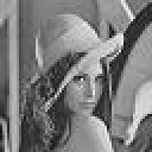
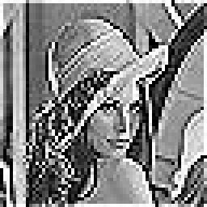
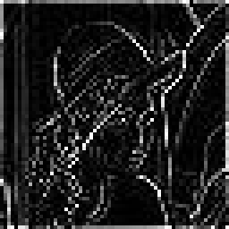

# DSP: Z-Transform 계산 및 2D FIR Filter 기반 이미지 처리

**과목/분야**: 디지털신호처리
**기간**: ~2025.12 (제출일 2025.12.17)
**사용 도구**: C++ (`<complex>`, `<vector>`, `<cmath>`, `<algorithm>`)

📄 원본 보고서: [docs/DSP_FIR_Filter_Report.pdf](docs/DSP_FIR_Filter_Report.pdf)

## 개요
C++로 1차원 z-Transform 계산기를 구현해 이론값과 비교(Lab 1)
2차원 FIR 필터(convolution)를 구현해 grayscale 이미지에 3가지 커널 적용(Lab 2)

> 소스 코드는 보고서에 스크린샷으로만 있어, 아래에 보고서 기준 핵심 코드를 옮김. 원본 `.cpp` 파일: [추가 정보 필요]

---

## Lab 1. Z-Transform

### 문제 정의
- 신호 `x[n] = aⁿ·u[n]` (a = 0.5)의 z-Transform을 유한 길이 신호로 계산
- `z = r·e^{jω}` (r = 0.9, ω = π/4)에서 이론식 `X(z) = 1 / (1 − a·z⁻¹)`과 비교

### 설계 및 구현
- 신호가 시작 지점 이후에만 존재하는 **right-sided** 신호로 가정
- `X(z) = Σ x[n]·z⁻ⁿ`을 누적하면서 `z_pow /= z`로 z⁻ⁿ 갱신

```cpp
complex<double> zTransform1D(const vector<double>& x, complex<double> z) {
    complex<double> X(0.0, 0.0);
    complex<double> z_pow(1.0, 0.0);          // z^{-0} = 1
    for (size_t n = 0; n < x.size(); ++n) {
        X += x[n] * z_pow;                    // x[n] * z^{-n}
        z_pow /= z;
    }
    return X;
}
```

### 결과
```
finite length signal : X(z) = 1.161 - j0.751169
이론식               : X(z) = 1.161 - j0.751169
```
- aⁿu[n]의 ROC는 |z| > |a|. |z| = 0.9 > 0.5로 ROC 내부에 있으므로 급수 수렴
- 유한 길이 합이 이론값(무한 등비급수)과 동일한 결과 확인

---

## Lab 2. 2D FIR Filter 이미지 처리

### 문제 정의
- 64×64 grayscale BMP(Lena_gray.bmp)의 R/G/B 채널에 2D FIR 필터를 적용하고, 커널별 이미지 변화를 관찰

### 설계 및 구현
- 배열 대신 `vector<vector<>>`를 입력으로 받아 열 길이를 고정하지 않도록 구현
- 경계 밖 픽셀은 제외하고, `round()` + `clamp(0, 255)`로 RGB 범위로 정규화

```cpp
vector<vector<int>> firFilter2D(const vector<vector<BYTE>>& input,
                                const vector<vector<double>>& kernel) {
    int rows = input.size(), cols = input[0].size();
    int kH = kernel.size(), kW = kernel[0].size();
    int kCenterY = kH / 2, kCenterX = kW / 2;
    vector<vector<int>> output(rows, vector<int>(cols, 0));
    for (int i = 0; i < rows; i++)
        for (int j = 0; j < cols; j++) {
            double sum = 0.0;
            for (int m = 0; m < kW; m++)
                for (int n = 0; n < kH; n++) {
                    int yy = i + (m - kCenterY), xx = j + (n - kCenterX);
                    if (yy < 0 || yy >= rows || xx < 0 || xx >= cols) continue;
                    sum += kernel[m][n] * input[yy][xx];
                }
            output[i][j] = static_cast<int>(clamp(round(sum), 0.0, 255.0));
        }
    return output;
}
```

| Kernel | 계수 | 성분 합 | 성격 |
|---|---|---|---|
| kernel1 | 3×3 전부 1/9 | 1 | 평균(Low-pass), smoothing |
| kernel2 | `[0 -1 0; -1 5 -1; 0 -1 0]` | 1 | Sharpening |
| kernel3 | `[0 -1 0; -1 4 -1; 0 -1 0]` | 0 | Edge 검출(Laplacian, DC 차단) |

### 결과
| 원본 | kernel1 (Smoothing) | kernel2 (Sharpening) | kernel3 (Edge) |
|:---:|:---:|:---:|:---:|
|  |  |  |  |

<sub>※ 보고서 내 64×64 결과 이미지를 보기 편하도록 256×256으로 확대(nearest)</sub>

- **kernel1**: 고주파 성분 억제로 경계가 흐려짐
- **kernel2**: 중심 픽셀 강조 및 주변과의 차이 증폭으로 경계선이 뚜렷해짐
- **kernel3**: 성분 합(= DC gain)이 0이라 저주파 영역은 0(검정)이 되고, 물체의 윤곽선만 남음
  - kernel1과 kernel2는 성분 합이 1이라 전체 밝기 유지

## 배운 점 / 의의
- 디지털 이미지가 가공되는 원리 이해
- 통신 신호처리의 noise 감소·신호 증폭 방법론이 2D 이미지 처리에도 그대로 적용된다는 점이 흥미로웠음
